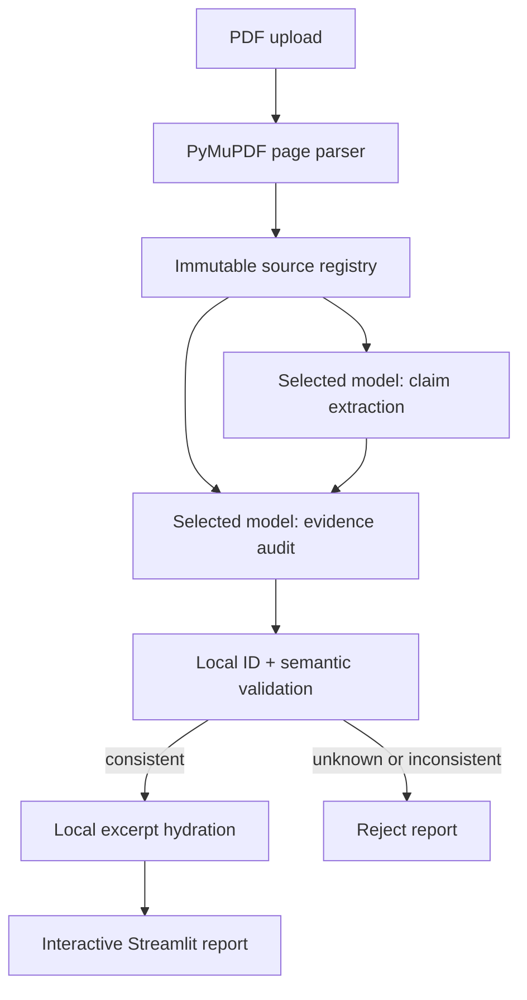

# ClaimTrace

**Most paper tools summarize. ClaimTrace makes every AI claim show its work.**

ClaimTrace turns a searchable biomedical paper into an interactive claim–evidence
audit. It identifies major scientific claims, links each one to page-preserved
paper spans, classifies the strength of the relationship, and flags interpretation
and reproducibility risks.

The central design rule is simple: **the analysis model never supplies the displayed
paper excerpt or page number.** PyMuPDF extracts those locally, assigns immutable
source IDs, and ClaimTrace accepts a model citation only if that ID resolves back
to the uploaded paper.

## Why it is different

1. **Source-locked citations.** The model may return only opaque source IDs. Every
   displayed quote, page number, and bounding box is restored from the local PDF
   index—not copied from model prose.
2. **Fail-closed trust boundary.** An unknown source ID or inconsistent relationship
   rejects the report. ClaimTrace does not silently repair, hide, or invent evidence.
3. **Audit, not summary.** Each claim is labeled `direct`, `indirect`, `partial`, or
   `unsupported`, then checked for overclaiming, controls, causal language,
   statistics, reproducibility, and generalizability.

```text
PDF parsed locally → model returns source IDs → app restores exact passages
                                         ↘ invalid link → reject the report
```

> ClaimTrace is a research-reading aid, not peer review, clinical guidance, or a
> substitute for inspecting the complete paper and supplementary materials.

## What the MVP does

- Accepts one searchable PDF through Streamlit.
- Extracts text blocks with one-based PDF page numbers and bounding boxes.
- Heuristically labels paragraphs, figure captions, table text, methods, and
  statistical-result spans.
- Uses the selected GPT-5.6 model to extract a configurable number of major claims.
- Uses the same model again to link evidence, apply a `direct` / `indirect` / `partial` /
  `unsupported` verdict, and audit each claim.
- Flags overclaiming, missing controls, causal overinterpretation,
  reproducibility limitations, statistical-reporting gaps, and generalizability.
- Rejects the whole report if the model references a source ID that the local PDF
  parser did not create.
- Rejects cross-field inconsistencies such as unsupported claims with evidence,
  supported claims without evidence, duplicate evidence links, or mismatched claim IDs.
- Clearly labels paper content and model inference in both the UI and JSON.
- Includes a zero-cost synthetic sample report for demos without an API key.
- Exports the validated report as structured JSON.
- Sends the same privacy-preserving, hashed session safety identifier with both API calls.

## Architecture



The application makes two model calls for a typical paper:

1. **Claim extraction.** The selected model receives the source registry and returns a
   `ClaimExtractionOutput` Pydantic object. A claim contains a faithful
   model-generated restatement plus source IDs pointing to where the authors state
   it.
2. **Evidence assessment.** The same model receives the candidate claims and the
   source registry, then returns `ClaimAssessmentOutput`: evidence source IDs,
   relationship labels, caveats, alternative interpretations, and audit flags.

Both calls use the OpenAI **Responses API**, `responses.parse`, and a Pydantic
`text_format`. The application exposes only an allowlisted GPT-5.6 family catalog;
reasoning effort is explicit and defaults to `medium`. `store=False` is set on each
request.
OpenAI recommends the Responses API for new direct model requests and Structured
Outputs when model text must conform to a schema:

- [Responses/text generation guide](https://developers.openai.com/api/docs/guides/text)
- [Structured Outputs guide](https://developers.openai.com/api/docs/guides/structured-outputs)

### Model choices

| Model | Product role | Best for |
| --- | --- | --- |
| `gpt-5.6-sol` | Best evidence judgment (default) | Difficult papers and subtle caveats |
| `gpt-5.6-terra` | Balanced | Routine analysis with a quality/cost/latency balance |
| `gpt-5.6-luna` | Fastest | High-volume screening and faster turnaround |

The browser never accepts an arbitrary model ID. UI labels and server-side
validation share the catalog in `claimtrace/model_catalog.py`. The roles follow
OpenAI's current [GPT-5.6 model guidance](https://developers.openai.com/api/docs/guides/latest-model).

Structured Outputs enforce the JSON shape, but they do **not** prove that a cited
source exists or supports a claim. `claimtrace/report_builder.py` therefore applies
business-rule validation after schema parsing and before the report reaches the UI.
It rejects unknown source IDs, duplicate or mismatched assessment claim IDs,
duplicate evidence links, and contradictions between an overall relationship and
its evidence list. ClaimTrace does not silently repair these responses.

### Privacy-preserving safety identifier

At the start of a Streamlit session, the app generates a random token with Python's
`secrets` module and retains it only in `st.session_state`. The analyzer applies a
domain-separated SHA-256 hash and sends only the resulting 64-character digest as
`safety_identifier`. The same digest is reused for claim extraction and evidence
auditing in that session. It is not derived from a name, email address, IP address,
filename, API key, or document content, and it is not included in the report.

When `analyze_document` is called outside Streamlit without a session token, it
generates one random token for that analysis call and reuses its hash across both
model stages. This keeps tests and other Python callers independent of Streamlit.
This follows OpenAI's [safety identifier guidance](https://developers.openai.com/api/docs/guides/safety-best-practices)
for logged-out, session-based experiences.

## Paper content vs. model inference

| Report element | Origin | Trust rule |
| --- | --- | --- |
| Page number, source ID, excerpt, bounding box | Local PyMuPDF extraction | Must exist in uploaded PDF registry |
| Figure/table label and section/type | Local extraction heuristic | Useful navigation label; inspect the paper |
| Restated claim | GPT-5.6 inference | Always linked to author claim-location spans |
| Direct/indirect/partial/unsupported label | GPT-5.6 inference | Analytical judgment, not paper content |
| Evidence explanation and caveat | GPT-5.6 inference | Never presented as a quotation |
| Issue flags and recommendations | GPT-5.6 inference | Absence is phrased as “not reported” |
| Confidence score | GPT-5.6 calibration | Not a probability or paper statistic |

### Relationship rubric

| Label | Meaning |
| --- | --- |
| `direct` | The cited result directly tests the material components of the claim in the stated system and scope. |
| `indirect` | The result is consistent with the claim or uses a proxy/model but does not directly test a material component. |
| `partial` | Only part of the claim is directly supported, or scope, comparator, controls, methods, or reporting leave a material gap. |
| `unsupported` | No source in the analyzed paper supports the claim as written. ClaimTrace leaves the evidence list empty rather than inventing a citation. |

## Quick start

### 1. Create an environment

Python 3.11 or 3.12 is recommended.

```bash
cd ClaimTrace
python -m venv .venv
source .venv/bin/activate       # Windows: .venv\Scripts\activate
python -m pip install --upgrade pip
pip install -r requirements.txt
```

### 2. Configure the API key

```bash
cp .env.example .env
```

Edit `.env` and set:

```dotenv
OPENAI_API_KEY=your_api_key_here
```

Alternatively, leave `.env` absent and paste a key into the password field in the
sidebar. The environment/Streamlit secret takes precedence over an empty field.

### 3. Run the app

```bash
streamlit run app.py
```

Open the local URL Streamlit prints. Upload a text-searchable biomedical PDF and
choose **Analyze with GPT-5.6**. To explore the complete interface without an API
key or API cost, choose **Load synthetic sample**.

## Tests

The tests generate PDFs in memory; no fixture paper or API key is required.

```bash
python -m unittest discover -s tests -v
```

The same tests can be run with pytest:

```bash
pytest -q
```

Both runners currently discover the same 23 tests. Coverage has expanded beyond
the original 12-test baseline to include semantic consistency, privacy-preserving
`safety_identifier` behavior, allowlisted model routing, and model-picker UI state.

Coverage includes:

- one-based page preservation and stable source IDs;
- figure, table, method, and statistical-span classification;
- rejection of non-PDF and image-only/no-OCR inputs;
- Pydantic Structured Output validation;
- a mocked two-stage GPT pipeline with the same Responses/Structured Output contract;
- allowlisted Sol/Terra/Luna routing and model-picker interaction;
- rejection of unknown model-generated source IDs;
- rejection of inconsistent relationship/evidence combinations and duplicate links;
- proof that displayed excerpts are hydrated only from the local source registry;
- validation of the bundled sample report.

### Validation status

- The offline synthetic-sample workflow is validated with Streamlit AppTest.
- PDF parsing, local hydration, fail-closed semantics, and report-schema validation
  are covered by the automated test suite.
- Structured model responses are exercised with mocked two-stage Responses API calls.
- The development environment used for this submission-readiness pass did not contain
  `OPENAI_API_KEY`, so it did **not** execute a paid live GPT-5.6 request.
- A real GPT-5.6 run requires a valid `OPENAI_API_KEY`. Complete at least one live,
  end-to-end validation before production deployment or hackathon submission.

Live-validation checklist:

- [ ] Parse a representative searchable biomedical PDF without warnings.
- [ ] Confirm major-claim extraction completes with GPT-5.6.
- [ ] Confirm each supported claim has a sensible evidence mapping.
- [ ] Confirm every model source ID hydrates from the local registry.
- [ ] Compare displayed page numbers against the original PDF.
- [ ] Download and validate the structured JSON export.
- [ ] Manually verify that every displayed excerpt exists on the cited uploaded-paper page.

## Deploy on Streamlit Community Cloud

1. Push this directory to a GitHub repository.
2. In Streamlit Community Cloud, create an app with `app.py` as the entry point.
3. Add the following app secret (do not commit it):

   ```toml
   OPENAI_API_KEY = "your_api_key_here"
   ```

4. Deploy. `requirements.txt` contains all runtime dependencies and
   `.streamlit/config.toml` caps uploads at 50 MB.

For another hosting platform, run:

```bash
streamlit run app.py --server.address 0.0.0.0 --server.port "$PORT"
```

### Public deployment safety

A server-side OpenAI API key can be abused if unrestricted live analysis is exposed
publicly. Before sharing a public URL:

- Set an OpenAI project spending limit and monitor usage.
- Keep Streamlit's maximum PDF size and `CLAIMTRACE_MAX_PAPER_CHARS` bounded.
- Restrict repeated live analyses per session at the hosting or application layer.
- Keep synthetic sample mode available so judges can inspect the product without cost.
- Consider disabling public live mode after judging is complete.
- Never commit `.env` or `.streamlit/secrets.toml`.

The repository's `.gitignore` explicitly excludes `.env`,
`.streamlit/secrets.toml`, `__pycache__/`, `.pytest_cache/`, and `*.pyc`.

## Configuration

| Variable | Default | Purpose |
| --- | ---: | --- |
| `OPENAI_API_KEY` | — | Required for live analysis |
| `CLAIMTRACE_DEFAULT_MODEL` | `gpt-5.6-sol` | Allowlisted model selected when the app opens |
| `CLAIMTRACE_MAX_PAPER_CHARS` | `500000` | Fail-closed prompt-size budget before any API call |
| `CLAIMTRACE_API_TIMEOUT_SECONDS` | `240` | Timeout for each of the two model requests |

The character limit is intentionally explicit. ClaimTrace does not silently drop
late pages, because hidden truncation could turn present evidence into a false
“unsupported” verdict. Increase the limit deliberately only after considering the
paper length, model context, latency, and cost.

### Versions validated during development

`requirements.txt` intentionally uses compatible ranges rather than pretending to
be a fully reproducible lockfile. The submission-readiness checks succeeded with the
following installed versions:

| Dependency | Validated version |
| --- | ---: |
| Python | `3.12.13` |
| Streamlit | `1.59.2` |
| OpenAI Python SDK | `2.46.0` |
| httpx | `0.28.1` |
| PyMuPDF | `1.28.0` |
| Pydantic | `2.13.4` |
| python-dotenv | `1.2.2` |
| pytest | `9.1.1` |

For a submission artifact, create a fresh environment from `requirements.txt`, run
the complete suite, and record the resolved environment if exact byte-for-byte
dependency reproduction is required.

## Project layout

```text
ClaimTrace/
├── LICENSE                        # MIT License
├── app.py                         # Streamlit UI and report explorer
├── claimtrace/
│   ├── analyzer.py                # Two-stage GPT-5.6 Responses pipeline
│   ├── exceptions.py              # Safe domain errors
│   ├── model_catalog.py            # Allowlisted model IDs and product roles
│   ├── models.py                  # Structured Output and report schemas
│   ├── pdf_parser.py              # Page-preserving PyMuPDF extraction
│   ├── prompts.py                 # Conservative provenance prompts
│   ├── report_builder.py          # Fail-closed ID validation + hydration
│   └── sample.py                  # Synthetic report loader
├── sample_outputs/
│   └── demo_report.json           # Complete fictional UI demonstration
├── tests/
│   ├── test_analyzer_pipeline.py
│   ├── test_pdf_parser.py
│   └── test_structured_output.py
├── .env.example
├── .streamlit/config.toml
└── requirements.txt
```

## Error handling and guardrails

- Invalid, empty, encrypted, and image-only PDFs fail with an actionable message.
- PDFs with extractable text on fewer than half their pages fail rather than imply
  full coverage.
- Oversized source registries fail before an API request; pages are never silently
  truncated.
- OpenAI authentication, access, rate-limit, connection, timeout, and bad-request
  errors are converted into concise UI messages.
- Pydantic rejects malformed enums, duplicate extraction claim IDs, extra fields,
  and invalid confidence values.
- Local provenance validation rejects unknown source IDs, missing/duplicated/unexpected
  assessment claim IDs, duplicate evidence links, and inconsistent relationship/evidence
  combinations with a claim-specific `TraceabilityError`.
- Uploaded paper text is rendered with `st.code`, so it is not interpreted as HTML
  or Markdown in the UI.
- Prompts explicitly treat the paper and candidate-claim payloads as untrusted data
  to reduce prompt-injection risk.
- Both Responses API stages preserve `store=False` and send the same hashed,
  non-identifying session `safety_identifier`.

## How Codex was used

ClaimTrace was developed collaboratively with Codex during OpenAI Build Week. Codex
served as an implementation and review assistant: it helped translate the product
specification into working code, inspect failures, and verify that the repository
matched its documented behavior. In particular, Codex assisted with:

- Scaffolding the Streamlit application.
- Implementing the page-preserving PyMuPDF parsing pipeline.
- Defining the Pydantic Structured Output schemas.
- Building the two-stage GPT-5.6 claim-extraction and evidence-auditing pipeline.
- Implementing fail-closed provenance and semantic-consistency validation.
- Creating the synthetic demonstration report.
- Writing and running automated tests.
- Reviewing current OpenAI API and SDK compatibility.
- Debugging Streamlit rendering and interaction behavior.
- Preparing setup, safety, validation, and deployment documentation.

Codex's role was implementation assistance, not autonomous product ownership. The
developer set the scientific-audit scope, made the safety tradeoffs, reviewed the
changes, and retained responsibility for the final product and submission. The
developer made these key decisions:

- Use immutable local source IDs instead of model-generated quotations.
- Reject the complete report when an unknown or inconsistent citation is returned.
- Keep paper content separate from model inference in the UI and JSON.
- Avoid OCR and visual figure interpretation in the MVP.
- Use two separate GPT-5.6 stages for claim extraction and evidence auditing.
- Never invent evidence absent from the uploaded paper.

Primary Codex /feedback Session ID: Provided separately in the Devpost submission.

## Known MVP limitations

- There is no OCR. Scan-only PDFs must be made searchable before upload.
- Figure and table interpretation is limited to extracted captions/text. ClaimTrace
  does not infer unseen panels, axes, cells, or image content.
- PyMuPDF reading order can be imperfect for multi-column or unusually laid-out
  papers. Bounding boxes and page numbers are retained to aid verification.
- Source-type and section labels are heuristic navigation metadata.
- Supplementary files are not merged automatically. Uploading only the main paper
  can make supplementary evidence appear unreported.
- ClaimTrace does not search cited literature or verify a claim against external
  evidence; it audits support within the uploaded paper only.
- Model judgments remain fallible even when their JSON is valid and their source IDs
  resolve. Inspect the cited excerpts and original pages before relying on a verdict.
- Two full-context model passes favor clarity and auditability over minimum token
  cost. A production version could add evaluated retrieval/chunking without silently
  reducing evidence coverage.

## Suggested production extensions

- OCR with page-level confidence and an explicit OCR provenance label.
- Rendered PDF-page previews with bounding-box highlighting.
- Separate supplementary-file registries and cross-document source IDs.
- Claim deduplication and evidence retrieval evaluated on a labeled paper set.
- Model/version and prompt-version telemetry plus regression evaluations.
- Human reviewer overrides stored alongside, never over, the model assessment.
- Export to HTML/PDF and interoperable review formats.

## License

ClaimTrace is available under the [MIT License](LICENSE).
